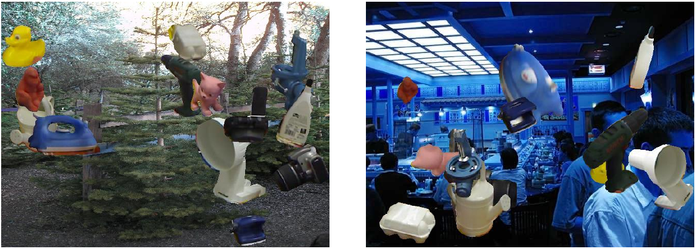

## Generating synthetic data for PVNet

### Prepare the dataset

Download the LINEMOD, which can be found at [here](https://zjueducn-my.sharepoint.com/:u:/g/personal/pengsida_zju_edu_cn/EXK2K0B-QrNPi8MYLDFHdB8BQm9cWTxRGV9dQgauczkVYQ?e=beftUz).

Download the LINEMOD_ORIG, which can be found at [here](https://zjueducn-my.sharepoint.com/:u:/g/personal/pengsida_zju_edu_cn/EaoGIPguY3FAgrFKKhi32fcB_nrMcNRm8jVCZQd7G_-Wbg?e=ig4aHk).

Download the SUN397

```
wget http://groups.csail.mit.edu/vision/SUN/releases/SUN2012pascalformat.tar.gz
```

### Create the soft link

Commands

```
ln -s path/to/LINEMOD ./data/LINEMOD
ln -s path/to/LINEMOD_ORIG ./data/LINEMOD_ORIG
ln -s path/to/SUN2012 ./data/SUN
```

### Configure the blender

Download blender-2.79a, and revise the `cfg.BLENDER_PATH` in the `config.py`.

### Run

**All the Commands must be carried out in the ROOT directory.**

10000 images from blender rendering

```
python run.py --type rendering
```

10000 images from fusion

```
python run.py --type fuse
```

### Examples

Blender rendering


Fusion



